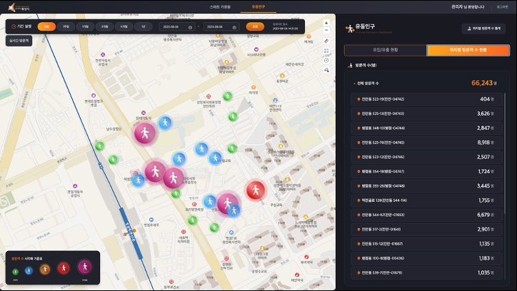
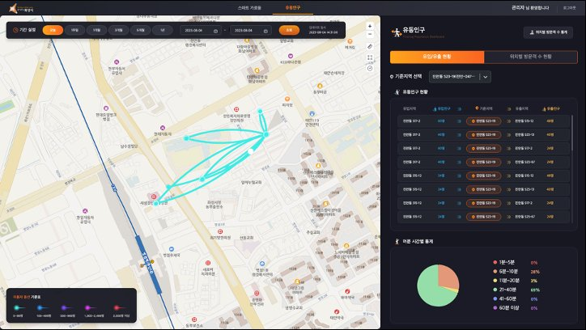
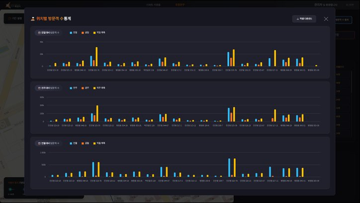

# 화성시 유동인구 대시보드 (FPS)

> **한 줄 소개**  
> 화성시 인구 밀집도와 지역별 인구 이동을 **실시간으로 시각화**해, 행사·축제 등에서 **인원 배치와 과밀집 사고 예방**에 활용되는 관리자용 대시보드입니다.

---

## 🎯 무엇을 위한 시스템인가요?

화성시에서 **행사가 열릴 때 특정 지역에 사람이 너무 몰려 사고가 나는 것을 예방**하기 위해 만든 시스템입니다.  
지도 위에 "지금 이 지역에 사람이 얼마나 있는지", "어디서 어디로 이동하는지"를 보여줘서, 담당자가 **인력을 어디에 더 배치할지 빠르게 판단**할 수 있게 해줍니다.

---

## 🖥️ 화면 구성

**"왼쪽은 지도, 오른쪽은 데이터 패널"** 구조의 단일 대시보드 화면입니다.

- **왼쪽 (지도)**: 화성시 전역을 Leaflet으로 표시. 지역별 밀집도 마커, 이동 경로가 표시됨
- **오른쪽 (데이터 패널)**: 선택한 지역·기간에 따라 방문자 수·체류시간·이동 현황·예측치를 표와 차트로 표시

---

## 🛠️ 주요 기능

### 1. 위치별 방문객 현황



- **지역별 인구 밀집도 시각화**  
  Leaflet 지도 위에 마커를 띄워, 사람이 많은 곳일수록 단계별로 다르게 표시
- **이동 지역·인구수 상세 표**  
  "A지역 → B지역으로 몇 명" 같은 구체적인 수치를 표로 제공

---

### 2. 인구 이동(Migration) 분석 · 예측 · 체류시간



- **인구 이동(Migration) 경로 시각화**  
  어디서 어디로 사람이 움직였는지 지도 위에 화살표/선으로 표현
- **방문자 수 예측**
- **평균 체류시간 분석** — 사람들이 그 지역에 얼마나 머물렀는지

---

### 3. 통계 차트 · 데이터 내보내기



- **날짜별 유동인구 통계 차트** (Highcharts)
- **엑셀 다운로드** — 분석 데이터를 파일로 내려받기

---

## 👤 담당 역할 (개발자 2명 풀스택)

- 화성시에서 제공한 **유동인구·인구 밀집도 API를 연계**해 DB에 데이터 적재
- 적재된 데이터를 **화면 요구사항에 맞춰 조회·가공하는 API 개발**
- **Leaflet을 활용한 인구 밀집도 단계별 마커** 및 **지역별 이동 현황 표출** UI 개발
- 프론트엔드(React) ↔ 백엔드(Spring Boot) 양쪽 모두 개발

---

## 🧱 사용한 기술

| 영역 | 기술 |
|---|---|
| 백엔드 언어/프레임워크 | Java 1.8, Spring Boot 2.7.1 |
| 백엔드 라이브러리 | Spring Data JPA / JDBC, Apache POI(엑셀), Gson, Lombok, Thymeleaf |
| 데이터베이스 | PostgreSQL |
| 프론트 언어/프레임워크 | React 18, TypeScript |
| 상태관리 | Redux Toolkit + Redux Saga |
| 지도(GIS) | Leaflet.js |
| 차트 | Highcharts |
| 스타일 | Styled Components |
| 빌드 | Maven (백엔드), npm (프론트) |

---

## 📂 전체 폴더 구조

```
hwaseong-fps/
├── src/main/java/com/eseict/fps/      # 백엔드 (Spring Boot)
│   ├── controller/    ⭐ API 입구 — 어떤 주소로 어떤 데이터를 받는지
│   │   └── fps/       — 유동인구 관련 API
│   ├── service/       ⭐ 실제 로직 — 화성시 API 데이터를 가공·계산
│   ├── dao/           — DB에서 데이터 가져오는 부분
│   ├── domain/        — DB 테이블에 해당하는 객체
│   ├── dto/           — 화면에 내려보낼 데이터 형식 정의
│   │   ├── fps/       — 유동인구·이동·지역 응답 형식
│   │   └── visitor/   — 방문자 수·예측 응답 형식
│   ├── config/        — DB 설정, 앱 전체 설정
│   └── utill/         — 공통 유틸 (HTTP 호출, 공통 함수)
│
├── src/main/resources/
│   └── home/
│       ├── system_config.properties   ⚠️ DB·외부 API 키 설정 파일
│       └── cctvData/cctvInfo.json     — CCTV 메타데이터
│
├── front/                              # 프론트엔드 (React + TypeScript)
│   └── src/
│       ├── config/    — 프론트 환경 설정
│       └── page/
│           ├── component/   ⭐ 화면 UI 컴포넌트
│           │   ├── fps/     — 유동인구 화면 (지도 + 데이터 패널)
│           │   └── common/  — 상단바 등 공통
│           ├── router/      — URL 주소와 화면 연결
│           ├── saga/        ⭐ 서버 API 호출 + 응답 처리
│           │   ├── apis/    — axios로 API 부르는 함수들
│           │   └── fps/     — FPS 관련 사가
│           └── store/       — Redux 상태 저장소
│               ├── server/  — 서버에서 받은 데이터 보관
│               └── view/    — 화면 상태(어느 탭, 어느 지역 선택 등)
│
├── pom.xml                — 백엔드 의존성 목록 (Maven)
├── mvnw, mvnw.cmd         — Maven 실행 스크립트
└── README.md              — 이 문서
```

> ⭐ 표시: 코드를 처음 볼 때 가장 먼저 열어보면 좋은 곳

---

## 🗺️ 기능 → 코드 위치 매핑

**파일/폴더명을 클릭하면 GitHub에서 바로 해당 위치로 이동합니다.**

### 백엔드 (서버) — 화성시 API를 받아서 화면에 내려주는 쪽

| 기능 | API 주소 | 핵심 파일 |
|---|---|---|
| 지역 목록 조회 | `GET /fps/region` | [FpsController.java](src/main/java/com/eseict/fps/controller/fps/FpsController.java) |
| 평균 체류시간 분석 | `GET /fps/stayTime` | [FpsController.java](src/main/java/com/eseict/fps/controller/fps/FpsController.java) |
| 방문자 수 집계 | `GET /fps/visitor` | [FpsController.java](src/main/java/com/eseict/fps/controller/fps/FpsController.java) |
| 방문자 수 예측 | `GET /fps/visitor/predictions` | [FpsController.java](src/main/java/com/eseict/fps/controller/fps/FpsController.java) |
| **인구 이동(Migration)** | `GET /fps/migration` | [FpsController.java](src/main/java/com/eseict/fps/controller/fps/FpsController.java) |
| 데이터 엑셀 다운로드 | `POST /fps/excelDownload` | [FpsController.java](src/main/java/com/eseict/fps/controller/fps/FpsController.java) |
| 비즈니스 로직 (데이터 가공) | — | [FpsService.java](src/main/java/com/eseict/fps/service/fps/FpsService.java) |
| DB 접근 | — | [FacDao.java](src/main/java/com/eseict/fps/dao/FacDao.java) |
| DB 설정 | — | [BJDataConfig.java](src/main/java/com/eseict/fps/config/db/BJDataConfig.java) |

### 프론트엔드 (화면) — 사용자가 보는 쪽

| 화면/기능 | 핵심 폴더·파일 |
|---|---|
| **전체 화면** (지도+패널 레이아웃) | [fpsRootArea.tsx](front/src/page/component/fps/fpsRootArea.tsx) |
| **지도(Leaflet) — 밀집도 마커 표시** | [fps/gis/](front/src/page/component/fps/gis) |
| └ 지도 컨트롤 | [gisControl.tsx](front/src/page/component/fps/gis/gisControl.tsx) |
| └ **밀집도 단계별 마커** | [gis/marker/](front/src/page/component/fps/gis/marker) |
| └ 마커 클릭 시 팝업 | [gis/popup/](front/src/page/component/fps/gis/popup) |
| └ 지도 위 레이어 | [gis/layer/](front/src/page/component/fps/gis/layer) |
| **유동인구 패널** (체류·이동·지역별) | [right/content/float/](front/src/page/component/fps/right/content/float) |
| └ 체류 통계 | [float/stayStat/](front/src/page/component/fps/right/content/float/stayStat) |
| └ 지역별 통계 | [float/region/](front/src/page/component/fps/right/content/float/region) |
| └ **차트 모달(날짜별 통계)** | [float/modal/chart/](front/src/page/component/fps/right/content/float/modal/chart) |
| **방문자 수 패널** | [right/content/visitor/](front/src/page/component/fps/right/content/visitor) |
| **공통 컴포넌트** | [component/common/](front/src/page/component/common) |
| └ 상단바 | [topbarArea.tsx](front/src/page/component/common/topbarArea.tsx) |
| └ 로딩 화면 | [loadingArea.tsx](front/src/page/component/common/loadingArea.tsx) |
| **라우팅(주소별 화면 연결)** | [router.tsx](front/src/page/router/router.tsx) |
| **서버 API 호출 로직** | [saga/apis/](front/src/page/saga/apis) · [fpsSaga.ts](front/src/page/saga/fps/fpsSaga.ts) |
| **상태 저장소(Redux Store)** | [page/store/](front/src/page/store) |

---

## 🔍 처음 코드를 보는 분께 — 추천 탐색 순서

1. **[router.tsx](front/src/page/router/router.tsx)** — 어떤 URL이 있고, 그 URL이 어떤 화면을 부르는지
2. **[fpsRootArea.tsx](front/src/page/component/fps/fpsRootArea.tsx)** — 메인 화면이 어떻게 구성되는지
3. **[FpsController.java](src/main/java/com/eseict/fps/controller/fps/FpsController.java)** — 화면이 어떤 API를 부르고 서버가 어떻게 답하는지
4. **[FpsService.java](src/main/java/com/eseict/fps/service/fps/FpsService.java)** — 실제 데이터 계산 로직
5. 관심 있는 기능이 보이면, 위의 **"기능 → 코드 위치 매핑"** 표에서 해당 폴더로 이동
